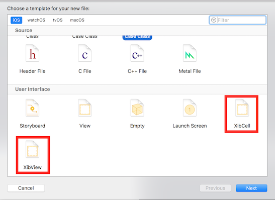
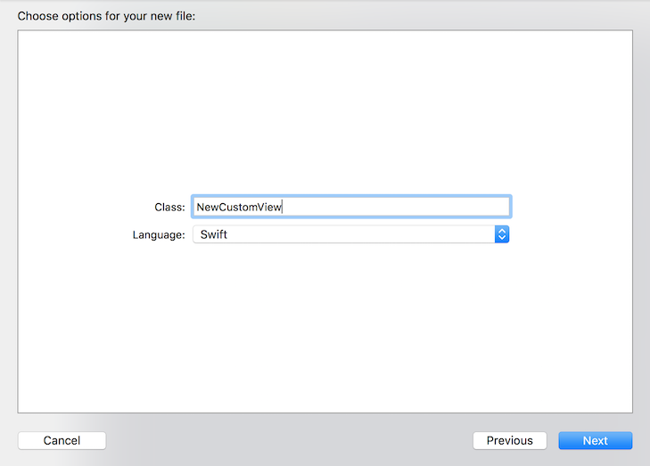

# XibView
A .xib based UIView.

A utility base class to develop custom views based on xib files.
It allows you to use a xib based view inside another xib based view, promoting reusable, isolated and composable views.

## Instalation

1. Import XibView.h and XibView.m if you're coding on objc or XibView.swift if you're coding on Swift.
2. Create a new view class which inherits from XibView (e.g.: CustomView).
3. Create a new .xib file with the same name your class (e.g.: CustomView.xib).
4. Set your class as first responder of your nib.

Steps 2 to 4 can be automated using [Xcode templates](##Automation-Using-XCode-Templates).

## Developing a .xib based custom view

Just add UI components to the view in the xib file, configure (colors, fonts, etc.), connect IBOutlets and IBActions, etc.

In another view .xib or view controller .xib or .storyboard, add a UIView and change its type to the new view.

## Automation using XCode templates

If you want to add the template, just download this repo, move to `./xcode-template` and run `./add-xibview-as-xcode-template`.

If you do so, you will see a XibView template when you create a new file to your project.

If you pick it, you must enter the new view class name and if it's objc or swift.

Done, you will find your files on the project navigator.

For objc:

For swift:

